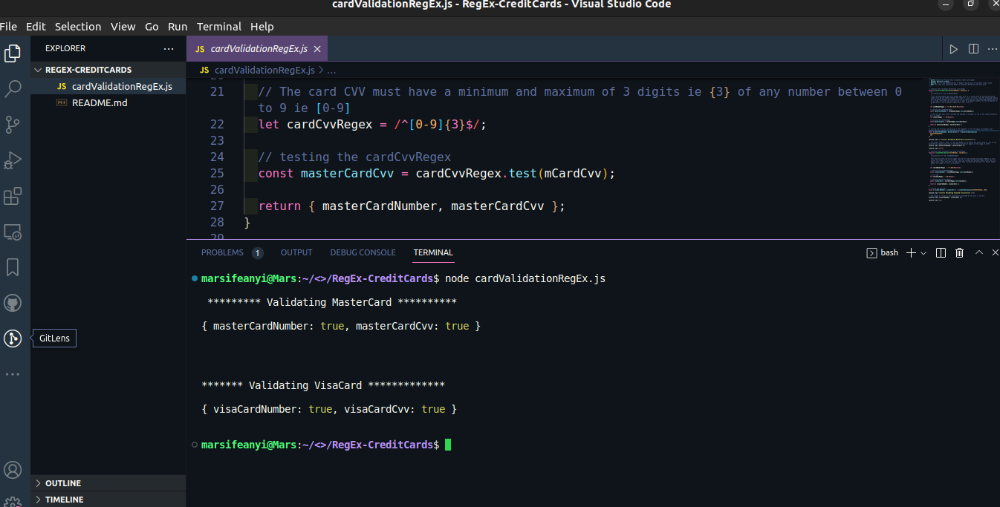
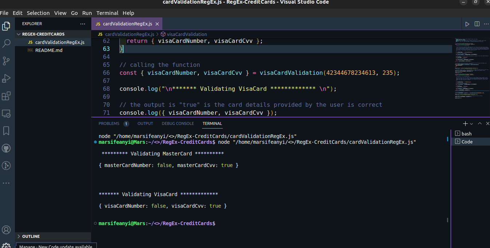
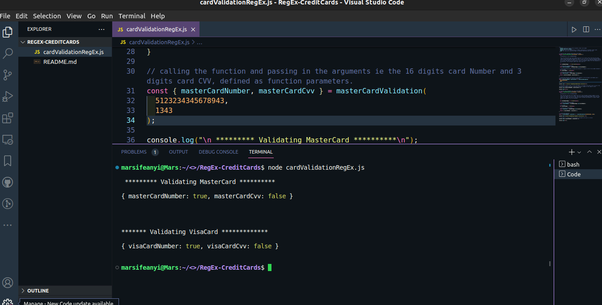

# Credit Card Validation using Regular Expressions

## Description

This is the Implementation of the Regular Expressions in JavaScript to validate MasterCards and VisaCards

This Project was done to test and demonstrate understanding of Regular Expressions in JavaScript and its application in Real life.

## Usage

- clone the repository and cd into the directory such that you are on `RegEx-CreditCards`
- To run this code, make sure you have [nodejs](https://nodejs.org) installed
- use the following command to run the code on your terminal

```bash
# run cardValidationRegEx.js

node cardValidationRegEx.js

```

## Sample output I

- If the `cardValidationRegEx.js` is run as it is on this repository, the Output should look like this, when the credit card details the user provided are correct. it returns "true"



## Sample Output II

This is the output when the card numbers are wrong. it returns "false"



## Sample Output III

This is the output when the card CVV code is wrong



## Contributing

This Project is Open for Contribution by all,
Pull requests are welcome.
For major changes, please open an issue first
to discuss what you would like to change.

### Instructions

- Fork this repository
- Clone your forked repository
- Add your scripts
- Commit and push
- Create a pull request
- Wait for pull request to merge

## Show your support

Give a ⭐️ if this project helped you!

## License

[MIT](https://choosealicense.com/licenses/mit/)
